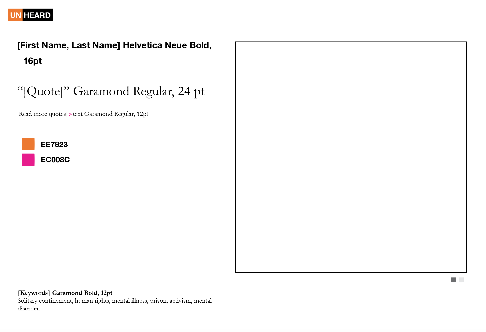

# Assignment 9

###This is a sketch of what I want my final project to be like. 

**TOPIC: Incarceration is tied to poverty and ethnicity in the US**

Based on the information found in the [Federal Bureau of Prison Statistics] (https://www.bop.gov/about/statistics/statistics_inmate_race.jsp)

And also, based on this visualization: https://www.youtube.com/watch?v=u51_pzax4M0

Map: http://trends.vera.org/incarceration-rates?year=1983
I would like to visualize the following:
- Incarceration rates increase after 1975 and until now. Visual reference:

