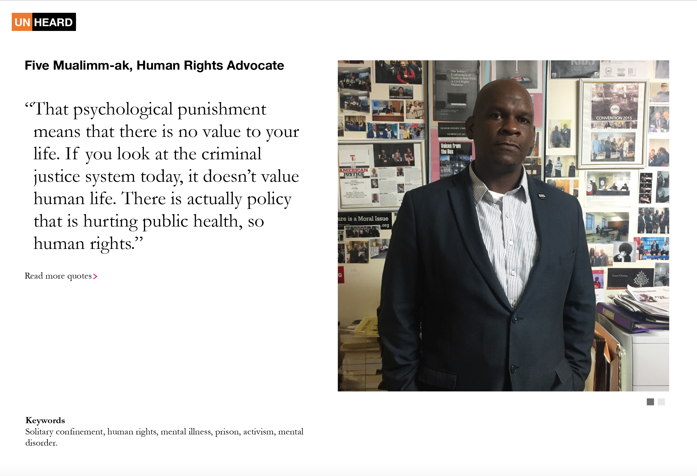
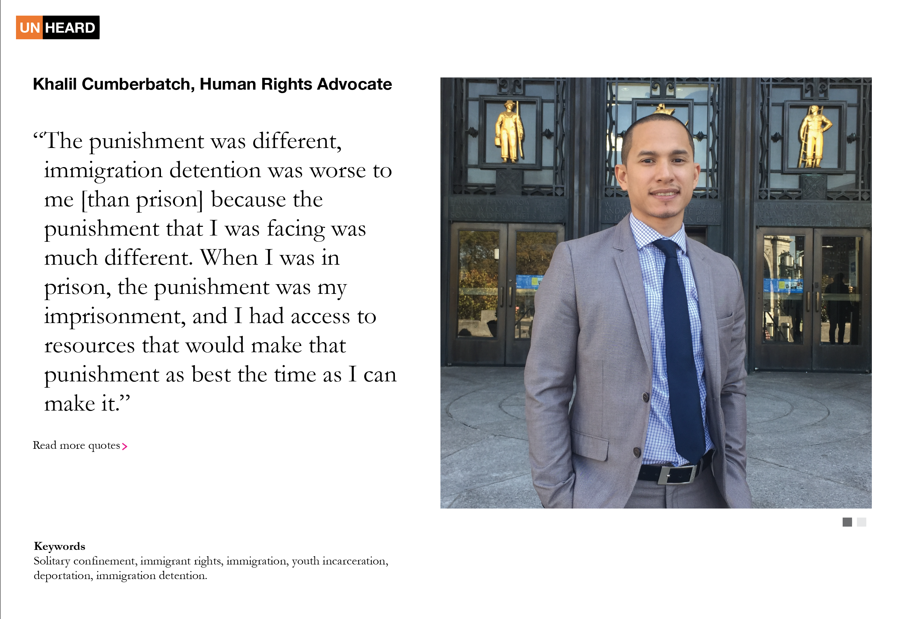

# Assignment 9

###This is a sketch of what I want my final project to be like. 

**TOPIC: Incarceration is tied to poverty and ethnicity in the US** I want to call it UNHEARD

Based on the information found in the [Federal Bureau of Prison Statistics] (https://www.bop.gov/about/statistics/statistics_inmate_race.jsp)

And also, based on this visualization: https://www.youtube.com/watch?v=u51_pzax4M0

Map: http://trends.vera.org/incarceration-rates?year=1983 and http://trends.vera.org/about
I would like to visualize the following:

I want the website to be divided in two. First, visualizations of data related to incarceration. Second, have a section in which I can feature the stories of people who have experienced the criminal justice system includingL: pictures, quotes, a brief summary and keywords of interviews of people who I have met with and have shared their story with me. 

